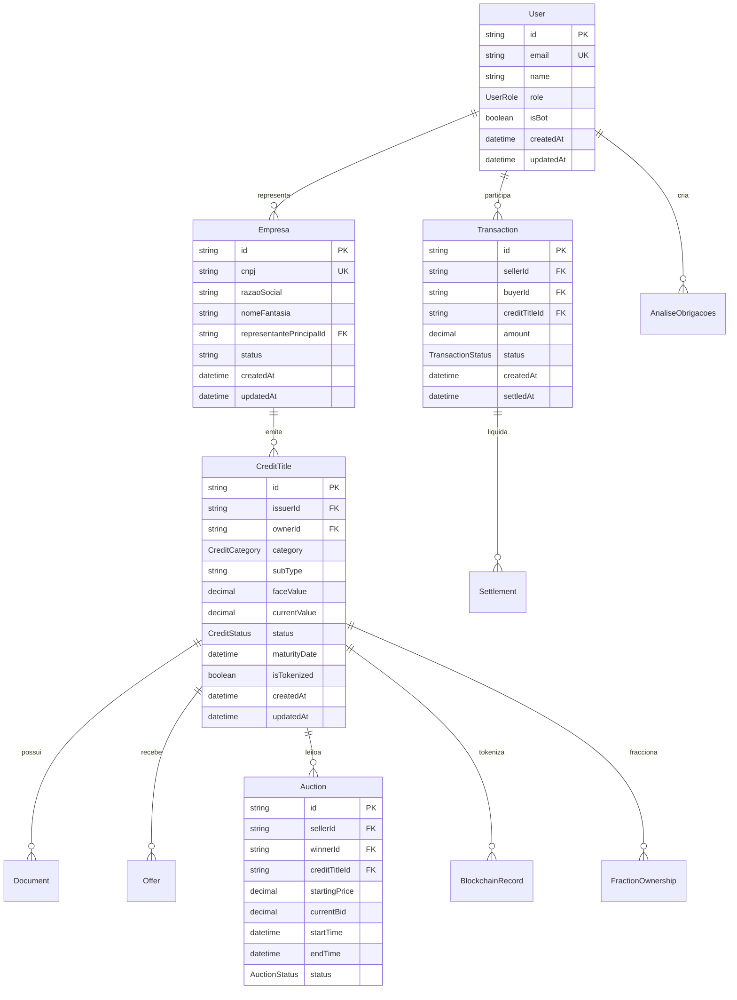

# 🗃️ DATABASE SCHEMA - TRIBUTA.AI

## 📋 **INFORMAÇÕES DO BANCO**
**SGBD:** PostgreSQL 15  
**ORM:** Prisma  
**Total de Models:** 54  
**Total de Linhas:** 1.722  
**Status:** Produção-ready (schema completo)

---

## 📖 **ÍNDICE**
1. [Visão Geral](#visão-geral)
2. [Diagrama ERD](#diagrama-erd)
3. [Models Principais](#models-principais)
4. [Relacionamentos](#relacionamentos)
5. [Índices e Performance](#índices-performance)
6. [Migrações](#migrações)
7. [Seeds e Dados Iniciais](#seeds-dados)
8. [Backup e Recovery](#backup-recovery)
9. [Otimizações](#otimizações)
10. [Troubleshooting](#troubleshooting)

---

## 🎯 **VISÃO GERAL** {#visão-geral}

### **Arquitetura do Banco:**
- **📊 54 Models** distribuídos em 8 domínios principais
- **🔗 Relacionamentos complexos** com foreign keys e índices
- **📈 Escalabilidade** preparada para milhões de registros
- **🔒 Segurança** com roles e permissões granulares

### **Domínios Principais:**
1. **👤 Autenticação** (5 models) - Usuários, sessões, contas
2. **🏢 Empresas** (3 models) - Gestão empresarial
3. **📄 Títulos de Crédito** (12 models) - 77 tipos de títulos
4. **🏪 Marketplace** (15 models) - Negociação e leilões
5. **⛓️ Blockchain** (8 models) - Tokenização e transparência
6. **📊 Análises** (5 models) - IA e recuperação de créditos
7. **🔒 Compliance** (4 models) - Auditoria e conformidade
8. **📈 Relatórios** (2 models) - Analytics e métricas

---

## 📊 **DIAGRAMA ERD** {#diagrama-erd}

### **Relacionamentos Principais:**


---

## 🔑 **MODELS PRINCIPAIS** {#models-principais}

### **1. 👤 AUTENTICAÇÃO (5 models)**

#### **User** - Usuários do sistema
```sql
Table: users
├── id: String (PK, cuid)
├── name: String?
├── email: String (UNIQUE)
├── emailVerified: DateTime?
├── image: String?
├── password: String?
├── role: UserRole (ADMIN|USER|EMPRESA|PROFISSIONAL_TRIBUTARIO|INVESTIDOR_QUALIFICADO)
├── isBot: Boolean (default: false)
├── createdAt: DateTime (default: now())
└── updatedAt: DateTime (auto-update)

Indexes:
- email (unique)
- role
- isBot
```

#### **Empresa** - Empresas participantes
```sql
Table: empresas
├── id: String (PK, cuid)
├── razaoSocial: String
├── nomeFantasia: String?
├── cnpj: String (UNIQUE)
├── inscEstadual: String?
├── inscMunicipal: String?
├── endereco: String?
├── telefone: String?
├── email: String? (UNIQUE)
├── website: String?
├── status: String (ACTIVE|INACTIVE|PENDING_APPROVAL)
├── representantePrincipalId: String (FK -> User.id)
├── createdAt: DateTime
└── updatedAt: DateTime

Indexes:
- cnpj (unique)
- email (unique)
- representantePrincipalId
- status
```

---

### **2. 📄 TÍTULOS DE CRÉDITO (12 models)**

#### **CreditTitle** - Título principal
```sql
Table: credit_titles
├── id: String (PK, cuid)
├── issuerId: String (FK -> User.id)
├── ownerId: String (FK -> User.id)
├── category: CreditCategory (TRIBUTARIO|COMERCIAL|FINANCEIRO|JUDICIAL|RURAL|IMOBILIARIO|AMBIENTAL|ESPECIAL)
├── subType: String (77 tipos diferentes)
├── faceValue: Decimal (valor original)
├── currentValue: Decimal (valor atual)
├── maturityDate: DateTime
├── status: CreditStatus (12 status diferentes)
├── isTokenized: Boolean
├── blockchainTxHash: String?
├── description: String?
├── legalBasis: Json?
├── riskRating: String?
├── createdAt: DateTime
└── updatedAt: DateTime

Indexes:
- issuerId
- ownerId
- category
- subType
- status
- maturityDate
- isTokenized
```

#### **CreditTitleTributario** - Específico para tributários
```sql
Table: credit_title_tributario
├── id: String (PK, cuid)
├── creditTitleId: String (FK -> CreditTitle.id, UNIQUE)
├── tipoTributario: TCTributarioFederal|TCTributarioEstadual|TCTributarioMunicipal
├── competencia: String
├── apuracaoEfd: String?
├── fundamentacaoLegal: Json
├── valorPrincipal: Decimal
├── valorJuros: Decimal?
├── valorMulta: Decimal?
├── valorCorrecao: Decimal?
└── dataApuracao: DateTime

Indexes:
- creditTitleId (unique)
- tipoTributario
- competencia
```

---

### **3. 🏪 MARKETPLACE (15 models)**

#### **Offer** - Ofertas de compra
```sql
Table: offers
├── id: String (PK, cuid)
├── creditTitleId: String (FK -> CreditTitle.id)
├── buyerId: String (FK -> User.id)
├── amount: Decimal
├── pricePerUnit: Decimal?
├── quantity: Int? (para frações)
├── status: OfferStatus (PENDING|ACCEPTED|REJECTED|EXPIRED)
├── message: String?
├── expiresAt: DateTime?
├── acceptedAt: DateTime?
├── createdAt: DateTime
└── updatedAt: DateTime

Indexes:
- creditTitleId
- buyerId
- status
- expiresAt
```

#### **Transaction** - Transações realizadas
```sql
Table: transactions
├── id: String (PK, cuid)
├── sellerId: String (FK -> User.id)
├── buyerId: String (FK -> User.id)
├── creditTitleId: String (FK -> CreditTitle.id)
├── offerId: String? (FK -> Offer.id)
├── auctionId: String? (FK -> Auction.id)
├── amount: Decimal
├── quantity: Int? (frações)
├── pricePerUnit: Decimal
├── totalValue: Decimal
├── fees: Decimal?
├── status: TransactionStatus (PENDING|CONFIRMED|CANCELLED|SETTLED)
├── paymentMethod: String?
├── settlementDate: DateTime?
├── createdAt: DateTime
├── createdById: String (FK -> User.id)
└── settledAt: DateTime?

Indexes:
- sellerId
- buyerId
- creditTitleId
- status
- createdAt
- settledAt
```

#### **Auction** - Leilões
```sql
Table: auctions
├── id: String (PK, cuid)
├── sellerId: String (FK -> User.id)
├── winnerId: String? (FK -> User.id)
├── creditTitleId: String (FK -> CreditTitle.id)
├── startingPrice: Decimal
├── currentBid: Decimal?
├── minBidIncrement: Decimal
├── startTime: DateTime
├── endTime: DateTime
├── status: AuctionStatus (SCHEDULED|ACTIVE|PAUSED|ENDED|CANCELLED)
├── description: String?
├── terms: Json?
├── autoExtension: Boolean (default: true)
├── createdAt: DateTime
└── updatedAt: DateTime

Indexes:
- sellerId
- winnerId
- creditTitleId
- status
- startTime
- endTime
```

---

### **4. ⛓️ BLOCKCHAIN (8 models)**

#### **BlockchainRecord** - Registros na blockchain
```sql
Table: blockchain_records
├── id: String (PK, cuid)
├── creditTitleId: String (FK -> CreditTitle.id)
├── transactionHash: String (UNIQUE)
├── blockNumber: BigInt?
├── network: String
├── contractAddress: String?
├── tokenId: String?
├── operation: String (MINT|TRANSFER|BURN|UPDATE)
├── from: String?
├── to: String?
├── value: Decimal?
├── gasUsed: BigInt?
├── gasPrice: BigInt?
├── status: String (PENDING|CONFIRMED|FAILED)
├── metadata: Json?
├── createdAt: DateTime
└── confirmedAt: DateTime?

Indexes:
- creditTitleId
- transactionHash (unique)
- network
- status
- operation
```

---

### **5. 📊 ANÁLISES (5 models)**

#### **AnaliseObrigacoes** - Análises de RCT
```sql
Table: analise_obrigacoes
├── id: String (PK, cuid)
├── empresaId: String? (FK -> Empresa.id)
├── usuarioId: String (FK -> User.id)
├── periodo: String
├── tipoAnalise: String
├── status: String (PROCESSANDO|CONCLUIDA|ERRO)
├── progresso: Int (0-100)
├── arquivoOriginal: String?
├── relatorioGerado: String?
├── creditosIdentificados: Json[]
├── valorTotalCreditos: Decimal?
├── confiancaMedia: Float?
├── observacoes: String?
├── tempoProcessamento: Int? (segundos)
├── criadoEm: DateTime
└── atualizadoEm: DateTime

Indexes:
- empresaId
- usuarioId
- status
- periodo
- criadoEm
```

---

### **6. 🔒 COMPLIANCE (4 models)**

#### **ComplianceAudit** - Auditorias de compliance
```sql
Table: compliance_audits
├── id: String (PK, cuid)
├── entityType: String (USER|EMPRESA|TRANSACTION)
├── entityId: String
├── auditType: String
├── status: String (PENDING|IN_PROGRESS|COMPLETED|FAILED)
├── score: Int? (0-100)
├── findings: Json[]
├── recommendations: Json[]
├── auditorId: String (FK -> User.id)
├── scheduledAt: DateTime?
├── startedAt: DateTime?
├── completedAt: DateTime?
├── nextAuditDue: DateTime?
├── createdAt: DateTime
└── updatedAt: DateTime

Indexes:
- entityType, entityId
- auditType
- status
- auditorId
- nextAuditDue
```

---

## 🔗 **RELACIONAMENTOS** {#relacionamentos}

### **Relacionamentos Um-para-Muitos:**
```sql
User (1) --> (N) Empresa           -- representante principal
User (1) --> (N) CreditTitle       -- emissor e proprietário
CreditTitle (1) --> (N) Document   -- documentos anexos
CreditTitle (1) --> (N) Offer      -- ofertas recebidas
User (1) --> (N) Transaction       -- transações como comprador/vendedor
CreditTitle (1) --> (N) Auction    -- leilões do título
```

### **Relacionamentos Muitos-para-Muitos:**
```sql
User (N) <--> (N) CreditTitle via FractionOwnership  -- propriedade fracionada
Transaction (1) --> (N) Settlement                   -- liquidações
Auction (1) --> (N) Bid                             -- lances do leilão
```

### **Relacionamentos Especiais:**
```sql
CreditTitle --> CreditTitleTributario    -- herança por categoria
CreditTitle --> BlockchainRecord         -- rastreabilidade blockchain
Transaction --> Settlement               -- processo de liquidação
```

---

## 📈 **ÍNDICES E PERFORMANCE** {#índices-performance}

### **Índices Principais:**
```sql
-- Performance crítica
CREATE INDEX idx_credit_titles_status_category ON credit_titles(status, category);
CREATE INDEX idx_transactions_dates ON transactions(createdAt, settledAt);
CREATE INDEX idx_offers_status_expires ON offers(status, expiresAt);
CREATE INDEX idx_auctions_active ON auctions(status, startTime, endTime);

-- Buscas frequentes
CREATE INDEX idx_users_email ON users(email);
CREATE INDEX idx_empresas_cnpj ON empresas(cnpj);
CREATE INDEX idx_blockchain_hash ON blockchain_records(transactionHash);

-- Análises e relatórios
CREATE INDEX idx_analises_periodo ON analise_obrigacoes(periodo, status);
CREATE INDEX idx_compliance_entity ON compliance_audits(entityType, entityId);
```

### **Otimizações de Query:**
```sql
-- Busca de títulos no marketplace
SELECT ct.*, u.name as owner_name 
FROM credit_titles ct 
JOIN users u ON ct.ownerId = u.id 
WHERE ct.status = 'LISTED_FOR_SALE' 
  AND ct.category = 'TRIBUTARIO'
ORDER BY ct.currentValue DESC
LIMIT 20;

-- Transações por período
SELECT DATE_TRUNC('month', createdAt) as month,
       COUNT(*) as total_transactions,
       SUM(totalValue) as total_volume
FROM transactions 
WHERE status = 'SETTLED'
  AND createdAt >= '2025-01-01'
GROUP BY DATE_TRUNC('month', createdAt)
ORDER BY month;
```

---

## 🔄 **MIGRAÇÕES** {#migrações}

### **Histórico de Migrações:**
```bash
# Listar migrações
npx prisma migrate status

# Criar nova migração
npx prisma migrate dev --name add_new_feature

# Deploy em produção
npx prisma migrate deploy

# Reset (apenas desenvolvimento)
npx prisma migrate reset
```

### **Migração de Exemplo:**
```sql
-- migrations/20250107120000_add_fraction_support/migration.sql
-- CreateTable
CREATE TABLE "fraction_ownerships" (
    "id" TEXT NOT NULL,
    "creditTitleId" TEXT NOT NULL,
    "ownerId" TEXT NOT NULL,
    "fractionCount" INTEGER NOT NULL,
    "totalFractions" INTEGER NOT NULL,
    "percentage" DECIMAL(5,2) NOT NULL,
    "acquiredAt" TIMESTAMP(3) NOT NULL DEFAULT CURRENT_TIMESTAMP,
    "createdAt" TIMESTAMP(3) NOT NULL DEFAULT CURRENT_TIMESTAMP,
    "updatedAt" TIMESTAMP(3) NOT NULL,

    CONSTRAINT "fraction_ownerships_pkey" PRIMARY KEY ("id")
);

-- CreateIndex
CREATE INDEX "fraction_ownerships_creditTitleId_idx" ON "fraction_ownerships"("creditTitleId");
CREATE INDEX "fraction_ownerships_ownerId_idx" ON "fraction_ownerships"("ownerId");
CREATE UNIQUE INDEX "fraction_ownerships_creditTitleId_ownerId_key" ON "fraction_ownerships"("creditTitleId", "ownerId");

-- AddForeignKey
ALTER TABLE "fraction_ownerships" ADD CONSTRAINT "fraction_ownerships_creditTitleId_fkey" FOREIGN KEY ("creditTitleId") REFERENCES "credit_titles"("id") ON DELETE RESTRICT ON UPDATE CASCADE;
ALTER TABLE "fraction_ownerships" ADD CONSTRAINT "fraction_ownerships_ownerId_fkey" FOREIGN KEY ("ownerId") REFERENCES "users"("id") ON DELETE RESTRICT ON UPDATE CASCADE;
```

---

## 🌱 **SEEDS E DADOS INICIAIS** {#seeds-dados}

### **Seed Principal:**
```typescript
// prisma/seed.ts
import { PrismaClient } from '@prisma/client';

const prisma = new PrismaClient();

async function main() {
  // 1. Criar usuários admin
  const admin = await prisma.user.create({
    data: {
      email: 'admin@tributa.ai',
      name: 'Admin Sistema',
      role: 'ADMIN',
      password: await hash('admin123')
    }
  });

  // 2. Criar empresa demo
  const empresa = await prisma.empresa.create({
    data: {
      cnpj: '12.345.678/0001-90',
      razaoSocial: 'Tech Solutions LTDA',
      nomeFantasia: 'TechSol',
      email: 'contato@techsol.com',
      status: 'ACTIVE',
      representantePrincipalId: admin.id
    }
  });

  // 3. Criar títulos de exemplo
  const titulo = await prisma.creditTitle.create({
    data: {
      issuerId: admin.id,
      ownerId: admin.id,
      category: 'TRIBUTARIO',
      subType: 'ICMS_DIFERENCIAL_ALIQUOTA',
      faceValue: 25000.00,
      currentValue: 25000.00,
      maturityDate: new Date('2025-12-31'),
      status: 'VALIDATED',
      description: 'Crédito de ICMS por diferencial de alíquota'
    }
  });

  console.log('Seed completed successfully!');
}

main()
  .catch((e) => {
    console.error(e);
    process.exit(1);
  })
  .finally(async () => {
    await prisma.$disconnect();
  });
```

### **Executar Seeds:**
```bash
# Executar seed
npx prisma db seed

# Seed específico
node prisma/seeds/empresas-seed.ts
```

---

## 💾 **BACKUP E RECOVERY** {#backup-recovery}

### **Backup Automático:**
```bash
#!/bin/bash
# scripts/db-backup.sh

DATE=$(date +%Y%m%d_%H%M%S)
BACKUP_DIR="/backups/tributa-ai"
DB_NAME="tributaai_prod"

# Backup completo
pg_dump -h localhost -U postgres -d $DB_NAME > $BACKUP_DIR/full_backup_$DATE.sql

# Backup apenas schema
pg_dump -h localhost -U postgres -d $DB_NAME --schema-only > $BACKUP_DIR/schema_backup_$DATE.sql

# Backup apenas dados
pg_dump -h localhost -U postgres -d $DB_NAME --data-only > $BACKUP_DIR/data_backup_$DATE.sql

# Cleanup (manter apenas últimos 7 dias)
find $BACKUP_DIR -name "*.sql" -mtime +7 -delete

echo "Backup completed: $DATE"
```

### **Recovery:**
```bash
#!/bin/bash
# scripts/db-restore.sh

BACKUP_FILE=$1

if [ -z "$BACKUP_FILE" ]; then
  echo "Usage: ./db-restore.sh backup_file.sql"
  exit 1
fi

# Restore
psql -h localhost -U postgres -d tributaai_prod < $BACKUP_FILE

echo "Database restored from $BACKUP_FILE"
```

---

## ⚡ **OTIMIZAÇÕES** {#otimizações}

### **Query Optimization:**
```sql
-- Usar EXPLAIN ANALYZE para otimizar queries lentas
EXPLAIN ANALYZE 
SELECT ct.*, COUNT(o.id) as offer_count
FROM credit_titles ct
LEFT JOIN offers o ON ct.id = o.creditTitleId
WHERE ct.status = 'LISTED_FOR_SALE'
GROUP BY ct.id
ORDER BY ct.currentValue DESC;

-- Adicionar índice composto se necessário
CREATE INDEX idx_credit_titles_status_value ON credit_titles(status, currentValue DESC);
```

### **Connection Pooling:**
```typescript
// lib/prisma.ts
import { PrismaClient } from '@prisma/client';

const globalForPrisma = globalThis as unknown as {
  prisma: PrismaClient | undefined;
};

export const prisma = globalForPrisma.prisma ?? 
  new PrismaClient({
    log: ['query', 'error', 'warn'],
    datasources: {
      db: {
        url: process.env.DATABASE_URL + '?connection_limit=20&pool_timeout=20'
      }
    }
  });

if (process.env.NODE_ENV !== 'production') globalForPrisma.prisma = prisma;
```

### **Caching Strategy:**
```typescript
// lib/cache.ts
import Redis from 'ioredis';

const redis = new Redis(process.env.REDIS_URL);

export async function getCachedCreditTitles(filters: any) {
  const cacheKey = `credit-titles:${JSON.stringify(filters)}`;
  const cached = await redis.get(cacheKey);
  
  if (cached) {
    return JSON.parse(cached);
  }
  
  const data = await prisma.creditTitle.findMany({
    where: filters,
    include: { documents: true, offers: true }
  });
  
  await redis.setex(cacheKey, 300, JSON.stringify(data)); // 5 min cache
  return data;
}
```

---

## 🔧 **TROUBLESHOOTING** {#troubleshooting}

### **Problemas Comuns:**

#### **🚫 Connection Issues**
```bash
# Verificar conexões ativas
SELECT * FROM pg_stat_activity WHERE datname = 'tributaai_prod';

# Matar conexões órfãs
SELECT pg_terminate_backend(pid) FROM pg_stat_activity 
WHERE datname = 'tributaai_prod' AND state = 'idle' AND query_start < now() - interval '1 hour';
```

#### **🐌 Queries Lentas**
```sql
-- Identificar queries lentas
SELECT query, mean_exec_time, calls, total_exec_time
FROM pg_stat_statements
ORDER BY mean_exec_time DESC
LIMIT 10;

-- Verificar locks
SELECT * FROM pg_locks WHERE NOT granted;
```

#### **💾 Espaço em Disco**
```bash
# Verificar tamanho do banco
SELECT pg_database.datname, pg_size_pretty(pg_database_size(pg_database.datname)) 
FROM pg_database;

# Verificar tabelas maiores
SELECT schemaname,tablename,pg_size_pretty(pg_total_relation_size(schemaname||'.'||tablename)) 
FROM pg_tables 
ORDER BY pg_total_relation_size(schemaname||'.'||tablename) DESC;

# Vacuum e reindex
VACUUM ANALYZE;
REINDEX DATABASE tributaai_prod;
```

---

## 📞 **MONITORAMENTO E ALERTAS**

### **Métricas Importantes:**
- **Connection Pool:** Uso atual vs máximo
- **Query Performance:** Tempo médio de resposta
- **Disk Usage:** Espaço livre restante
- **Lock Contention:** Locks de longa duração
- **Replication Lag:** Atraso da réplica (se aplicável)

### **Alertas Críticos:**
- Connection pool > 80%
- Query time > 5 segundos
- Disk usage > 85%
- Lock duration > 30 segundos
- Backup failure

---

**📌 Esta documentação é atualizada constantemente. Versão atual: 1.0 (Janeiro 2025)**