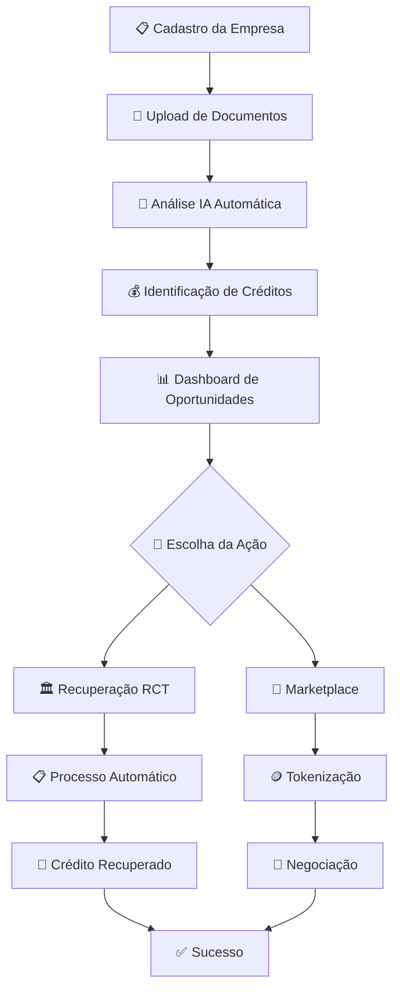

# 📚 MANUAIS OPERACIONAIS - TRIBUTA.AI

## 📋 **INFORMAÇÕES DO MANUAL**
**Data de Criação:** 07 de Janeiro de 2025  
**Versão:** 1.0  
**Objetivo:** Manual completo de operação da plataforma  
**Público-alvo:** Usuários finais, administradores e desenvolvedores

---

## 📖 **ÍNDICE**
1. [Introdução à Plataforma](#introdução)
2. [Workflow Principal](#workflow)
3. [Tipos de Títulos de Crédito](#tipos-títulos)
4. [Tutoriais Passo a Passo](#tutoriais)
5. [Guias Práticos](#guias-práticos)
6. [Troubleshooting](#troubleshooting)
7. [FAQ - Perguntas Frequentes](#faq)

---

## 🎯 **INTRODUÇÃO À PLATAFORMA** {#introdução}

### **O que é o Tributa.AI?**
O Tributa.AI é uma plataforma dual que integra:
- **🏛️ RCT (Recuperação de Créditos Tributários):** Automação completa para identificação e recuperação de créditos fiscais
- **🏪 Marketplace Universal:** Ambiente seguro para negociação de títulos de crédito tokenizados

### **Benefícios Principais:**
- ✅ **Automação total** de processos fiscais
- ✅ **Compliance** automático com legislação
- ✅ **Marketplace seguro** para títulos
- ✅ **Blockchain** para transparência
- ✅ **IA integrada** para análises preditivas

---

## 🔄 **WORKFLOW PRINCIPAL** {#workflow}

### **Fluxo Completo da Plataforma:**

### **Etapas Detalhadas:**

#### **1. 📋 Cadastro da Empresa**
- **Tempo:** 5-10 minutos
- **Documentos necessários:** CNPJ, Contrato Social, Certidões
- **Validação:** Automática via Receita Federal

#### **2. 📄 Upload de Documentos**
- **Formatos aceitos:** PDF, XML, Excel
- **OCR automático:** Extração de dados
- **Classificação IA:** Identificação do tipo de documento

#### **3. 🤖 Análise IA Automática**
- **Tempo de processamento:** 2-5 minutos
- **Análise:** Cruzamento com base legal
- **Resultado:** Score de oportunidades

#### **4. 💰 Identificação de Créditos**
- **Tipos detectados:** 77 modalidades
- **Valor estimado:** Cálculo automático
- **Prazo:** Cronograma de recuperação

#### **5. 📊 Dashboard de Oportunidades**
- **Visualização:** Gráficos interativos
- **Filtros:** Por tipo, valor, prazo
- **Exportação:** Relatórios PDF/Excel

---

## 📄 **TIPOS DE TÍTULOS DE CRÉDITO** {#tipos-títulos}

### **77 Tipos Suportados pela Plataforma:**

#### **🏛️ TÍTULOS TRIBUTÁRIOS (13 tipos)**
1. **IRPJ** - Imposto de Renda Pessoa Jurídica
2. **CSLL** - Contribuição Social sobre Lucro Líquido
3. **PIS** - Programa de Integração Social
4. **COFINS** - Contribuição para Financiamento da Seguridade Social
5. **ICMS** - Imposto sobre Circulação de Mercadorias e Serviços
6. **IPI** - Imposto sobre Produtos Industrializados
7. **IOF** - Imposto sobre Operações Financeiras
8. **INSS** - Instituto Nacional do Seguro Social
9. **FGTS** - Fundo de Garantia do Tempo de Serviço
10. **IPVA** - Imposto sobre Propriedade de Veículos Automotores
11. **ITCMD** - Imposto de Transmissão Causa Mortis e Doação
12. **ISS** - Imposto sobre Serviços
13. **IPTU** - Imposto Predial e Territorial Urbano

#### **💼 TÍTULOS COMERCIAIS (6 tipos)**
14. **Duplicata Mercantil** - Vendas a prazo
15. **Duplicata de Serviço** - Prestação de serviços
16. **Duplicata Rural** - Atividades rurais
17. **Nota Promissória** - Promessa de pagamento
18. **Letra de Câmbio** - Ordem de pagamento
19. **Cheque** - Ordem de pagamento à vista

#### **⚖️ TÍTULOS JUDICIAIS (7 tipos)**
20. **Precatório Federal** - Dívidas da União
21. **Precatório Estadual** - Dívidas dos Estados
22. **Precatório Municipal** - Dívidas dos Municípios
23. **RPV Federal** - Requisição de Pequeno Valor Federal
24. **RPV Estadual** - Requisição de Pequeno Valor Estadual
25. **RPV Municipal** - Requisição de Pequeno Valor Municipal
26. **Alvará Judicial** - Liberação judicial de valores

#### **🏦 TÍTULOS FINANCEIROS (8 tipos)**
27. **CDB** - Certificado de Depósito Bancário
28. **RDB** - Recibo de Depósito Bancário
29. **LCI** - Letra de Crédito Imobiliário
30. **LCA** - Letra de Crédito do Agronegócio
31. **Debênture** - Títulos de dívida corporativa
32. **CRI** - Certificado de Recebíveis Imobiliários
33. **CRA** - Certificado de Recebíveis do Agronegócio
34. **FIDC** - Fundo de Investimento em Direitos Creditórios

#### **💰 TÍTULOS DE COMPENSAÇÃO (43 tipos)**
35-77. **Créditos Especializados** incluindo:
- Créditos de ICMS diferencial de alíquota
- Créditos de ICMS substituição tributária
- Créditos de PIS/COFINS monofásico
- Créditos de IPI por exportação
- E outros 39 tipos específicos

---

## 🎓 **TUTORIAIS PASSO A PASSO** {#tutoriais}

### **Tutorial 1: Primeiro Acesso à Plataforma**

#### **Passo 1: Criando sua Conta**
1. Acesse `https://tributa.ai`
2. Clique em **"Cadastre-se"**
3. Preencha:
   - **E-mail corporativo**
   - **CNPJ da empresa**
   - **Senha segura** (mín. 8 caracteres)
4. Confirme o e-mail recebido
5. Complete o perfil empresarial

#### **Passo 2: Configuração Inicial**
1. Faça upload do **Contrato Social**
2. Adicione **Certidões Negativas**
3. Configure **Regime Tributário**
4. Defina **Responsáveis** (contador, administrador)

#### **Passo 3: Dashboard Principal**
- **Visão geral:** Resumo de oportunidades
- **Menu lateral:** Navegação principal
- **Notificações:** Alertas importantes
- **Perfil:** Configurações da conta

---

### **Tutorial 2: Analisando Oportunidades de Crédito**

#### **Passo 1: Upload de Documentos**
1. Acesse **"Documentos"** no menu
2. Clique em **"Adicionar Documentos"**
3. Selecione **categoria:**
   - 📋 Declarações (EFD, SPED)
   - 🧾 Notas Fiscais
   - 📊 Balanços
   - 🏛️ Documentos Governamentais
4. Faça upload (múltiplos arquivos suportados)
5. Aguarde **processamento automático**

#### **Passo 2: Análise Inteligente**
1. Vá para **"Análises"**
2. Visualize **score de oportunidades**
3. Filtre por:
   - **Tipo de crédito**
   - **Valor estimado**
   - **Prazo de recuperação**
   - **Complexidade**

#### **Passo 3: Detalhamento de Créditos**
1. Clique em uma **oportunidade identificada**
2. Revise **fundamentação legal**
3. Confira **cálculos automáticos**
4. Baixe **relatório detalhado**

---

### **Tutorial 3: Usando o Marketplace**

#### **Passo 1: Tokenizando um Título**
1. Acesse **"Marketplace"**
2. Clique em **"Tokenizar Título"**
3. Selecione o **título de crédito**
4. Configure:
   - **Valor mínimo de venda**
   - **Prazo de oferta**
   - **Documentação anexa**
5. Confirme **tokenização**

#### **Passo 2: Publicando no Marketplace**
1. Vá para **"Meus Títulos"**
2. Clique em **"Publicar"**
3. Defina **estratégia de venda:**
   - 🏷️ Preço fixo
   - 🔨 Leilão
   - 📈 Oferta gradual
4. Publique **oferta**

#### **Passo 3: Comprando Títulos**
1. Navegue pelo **"Marketplace"**
2. Use **filtros avançados**
3. Analise **score de risco**
4. Faça **proposta** ou **compre direto**
5. Confirme **transação**

---

## 🛠️ **GUIAS PRÁTICOS** {#guias-práticos}

### **Guia 1: Maximizando Recuperação de Créditos**

#### **Estratégias Eficazes:**
1. **📅 Frequência de análises:** Mensal
2. **📋 Documentação completa:** 100% dos docs
3. **🤖 IA otimizada:** Configure filtros inteligentes
4. **⏰ Prazos legais:** Monitore vencimentos
5. **🔄 Processo contínuo:** Não pontual

#### **Checklist de Otimização:**
- [ ] **EFD atualizada** mensalmente
- [ ] **SPED completo** de todos os períodos
- [ ] **Notas fiscais** organizadas por período
- [ ] **Certidões** válidas e atualizadas
- [ ] **Contador** com acesso à plataforma

---

### **Guia 2: Navegação Avançada**

#### **Atalhos de Teclado:**
- `Ctrl + D` → Dashboard principal
- `Ctrl + A` → Análises
- `Ctrl + M` → Marketplace
- `Ctrl + R` → Relatórios
- `Ctrl + C` → Chat IA (ARIA)

#### **Filtros Inteligentes:**
- **Por valor:** `>R$ 10.000`
- **Por prazo:** `<90 dias`
- **Por tipo:** `ICMS`, `PIS/COFINS`
- **Por complexidade:** `Baixa`, `Média`, `Alta`

---

### **Guia 3: Integrações e APIs**

#### **Conectando Sistemas Existentes:**
1. **ERP Integration:**
   - SAP, TOTVS, Senior
   - API REST disponível
   - Webhook automático

2. **Contabilidade:**
   - Domínio Sistemas
   - Alterdata
   - Thomson Reuters

3. **Banking:**
   - Open Banking
   - PIX integrado
   - TED automático

---

## 🔧 **TROUBLESHOOTING** {#troubleshooting}

### **Problemas Comuns e Soluções:**

#### **🚫 Erro de Login**
**Problema:** Não consegue acessar a conta
**Soluções:**
1. Verifique **e-mail e senha**
2. Use **"Esqueci minha senha"**
3. Limpe **cache do navegador**
4. Teste em **modo anônimo**
5. Contate **suporte@tributa.ai**

#### **📄 Erro no Upload**
**Problema:** Documento não carrega
**Soluções:**
1. **Formato:** Use PDF, XML, Excel
2. **Tamanho:** Máximo 50MB por arquivo
3. **Conexão:** Verifique internet
4. **Navegador:** Use Chrome/Firefox atualizados
5. **Compressão:** Reduza tamanho se necessário

#### **🤖 IA Não Encontra Créditos**
**Problema:** Análise não detecta oportunidades
**Possíveis causas:**
1. **Documentos incompletos**
2. **Período muito antigo** (>5 anos)
3. **Regime tributário** não configurado
4. **Base legal** não aplicável
5. **Já recuperado** anteriormente

**Soluções:**
1. Complete **documentação**
2. Verifique **configurações**
3. Consulte **ARIA (IA)**
4. Solicite **revisão manual**

#### **💱 Erro no Marketplace**
**Problema:** Transação não finaliza
**Verificações:**
1. **Saldo suficiente** na carteira
2. **Documentos válidos** do título
3. **Status ativo** da oferta
4. **Limites de transação**
5. **Horário de funcionamento**

---

## ❓ **FAQ - PERGUNTAS FREQUENTES** {#faq}

### **Sobre a Plataforma**

**Q: O Tributa.AI é seguro?**
A: Sim. Utilizamos:
- 🔒 **Criptografia end-to-end**
- 🏛️ **Compliance LGPD**
- 🔐 **Autenticação 2FA**
- 🛡️ **Monitoramento 24/7**
- ⛓️ **Blockchain** para transparência

**Q: Quanto tempo leva a análise?**
A: **2-5 minutos** para análise inicial da IA. Revisões complexas podem levar **24-48h**.

**Q: Qual o custo da plataforma?**
A: **Freemium** com análises básicas gratuitas. Planos pagos a partir de **R$ 299/mês**.

### **Sobre Créditos Tributários**

**Q: Que tipos de crédito posso recuperar?**
A: **77 tipos diferentes**, incluindo ICMS, PIS/COFINS, IPI, IRPJ, CSLL e outros.

**Q: Preciso de contador?**
A: **Recomendado** mas não obrigatório. A plataforma automatiza a maioria dos processos.

**Q: Quanto posso recuperar?**
A: Varia por empresa. **Média:** 2-8% do faturamento anual em créditos identificados.

### **Sobre o Marketplace**

**Q: Como funciona a tokenização?**
A: Convertemos títulos físicos em **tokens blockchain**, garantindo **transparência** e **liquidez**.

**Q: Posso vender parcialmente?**
A: Sim. **Fracionamento** de títulos disponível a partir de **R$ 1.000**.

**Q: Qual a taxa do marketplace?**
A: **2,5%** sobre transações efetivadas + taxa blockchain.

### **Suporte Técnico**

**Q: Como falar com suporte?**
A: 
- 💬 **Chat:** Disponível 24/7 na plataforma
- 📧 **E-mail:** suporte@tributa.ai
- 📞 **Telefone:** (11) 99999-9999
- 🤖 **ARIA:** IA assistente integrada

**Q: Existe treinamento?**
A: Sim. **Onboarding gratuito** + **webinars mensais** + **documentação completa**.

---

## 📞 **CONTATOS E SUPORTE**

### **Canais de Atendimento:**
- 💬 **Chat 24/7:** Disponível na plataforma
- 📧 **E-mail:** suporte@tributa.ai
- 📞 **Telefone:** (11) 99999-9999
- 🤖 **ARIA (IA):** Assistente inteligente
- 📹 **Videochamada:** Agendamento via plataforma

### **Horários:**
- **Suporte técnico:** 24/7
- **Consultoria:** Seg-Sex 8h-18h
- **Emergências:** 24/7

### **Recursos Adicionais:**
- 📚 **Base de conhecimento:** help.tributa.ai
- 🎥 **Videotutoriais:** youtube.com/tributaai
- 📖 **Blog:** blog.tributa.ai
- 🗣️ **Comunidade:** forum.tributa.ai

---

**📌 Este manual é atualizado constantemente. Versão atual: 1.0 (Janeiro 2025)**